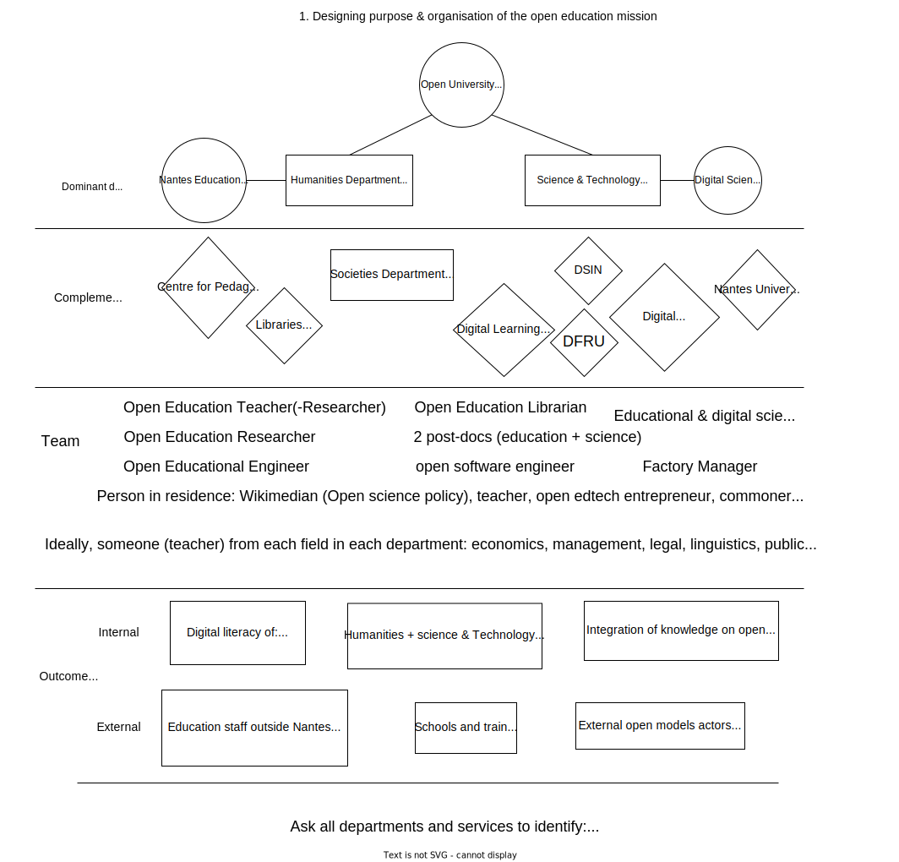

# Mission on open education - Nantes University Application

## « Openness » Project (ExcellencES) : Mandate the university

**Goal:** Rely on the university's competences to develop the strategy for open education and education on open models
with the intent to **integrate openness practices into digital literacy**. Build a common digital
heritage and expertise to support an openness culture.

A desire to let researchers and lecturers guide the mission, while at the same time allowing an investment in their
areas of expertise. An approach oriented to help all members of the university to develop their digital skills
to let everyone benefit from the openness program & grant(s).

## The Digital Commons Factory

{width=50%}

An entry point to build any type of digital commons and cover all types of digital resources produced by the
university community. A place to find appropriate tools and methodology to enable open collaboration.

- Pedagogical commons
- Research work and articles
- Open software
- Open data
- Open hardware
- Any kind of open resources

**The knowledge base**, a format to explore ? Hence the [brick of knowledge on open models](https://open-models.org/).

> Support of a digital commons on climate such as [Infoclimat](https://www.infoclimat.fr/) ?

Collaboration with emerging factories: [Fabrique REL](https://fabriquerel.org/), [Pedagogical Commons Factory](https://fabpeda.org/), [Mobility Factory](https://lafabriquedesmobilites.fr/), [Health Factory](https://www.fabsan.cc/), [Geocommons Factory](https://www.ign.fr/institut/la-fabrique-des-geocommuns-incubateur-de-communs-lign)...

> Valuable to have an experienced maintainer to manage the factory.

### First Factory Project: The open education mission

Use the mission on open education as a first federating project to explore the potential of the factory in a research
and development approach.

Organize a **call for commons** on the project « Openness » & the open education strategy:

- A topic on implementation of open education within people's own curriculum, whether they be teachers or students ?
- Call in support of open education strategy & open university philosophy, open to the outside world

### Lack of open software policy: support Open Scholarly Infrastructure

Despite the essential nature of software with open models, Nantes University lacks the open software dimension in its holistic approach. To be supported for open education in parallel with the development of axis 3 of the open science strategy.

Listing of existing tools usable for digital commons at first: (university's [GitLab](https://gitlab.univ-nantes.fr/), Wiki technology, Quarto, LibreText, Cours en Ligne (CEL) HAL, Open Science Framework...).

Shared infrastructure issues with open models players, seek to embrace the worldwide movement with the help of the IT department.

Use of the factory to build the IT infrastructure. Foster a spirit of continuous evolution in the construction of software tools in research and education.

How to manage the university common digital heritage: which place for libraries and open libraries in the management of open resources? Bringing the debate on the infrastructure of science and education with the horizon of **digital libraries**.

## Open Models Program Office (OSPO like)

Democratic hub for the governance of the openness strategy:  

- Organise evolutive roadmap with university stakeholders
- Interface between policy and operational aspects
- Guide research and teaching orientation 

Question of open models federation, iniate OMPO by an openness committee.

Interaction with other OSPO/OMPO entities to explore open models & support the professionalization of open models players

## Define open source

Confusion over the meaning of open source, within and beyond software. Importance of open source resources with open models.

What is the impact of a change in the meaning of open source? Ex: role of OSPOs & IT architectures

## Resources & license

Content under creative commons CC 0 and available on [GitHub](https://github.com/AbcSxyZ/open-education-mission), find related resources on a [Zotero shared library](https://www.zotero.org/groups/5511462/nantes-university/library).
